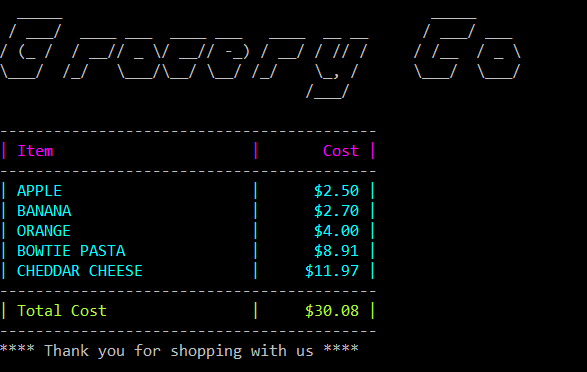

# CheckoutApp
Grocery Co Checkout App

## Usage
```bash
CheckoutApp
Copyright (C) 2012 Jaison.B

ERROR(S):
  -i/--input-file required option is missing.
  -p/--product-file required
option is missing.
  -d/--discount-file required option is missing.


  -i, --input-file       Required. Order input file

  -p, --product-file     Required. Product catalog file

  -d, --discount-file    Required. Promotion input file

  --help                 Display help screen.
```

### Testing Sample Data
In the bin folder where the executable was generated you should find SampleData folder run the executable as follows:
```bash
CheckoutApp -i SampleData\orders.txt -p SampleData\products.txt -d SampleData\promotions.txt
```
#### Result:


