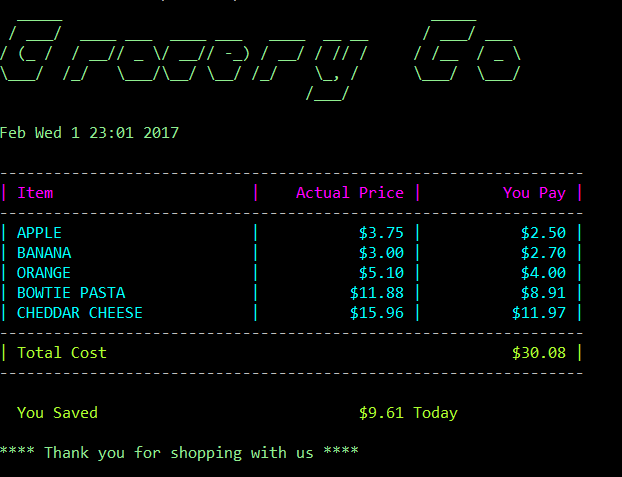

# CheckoutApp
Grocery Co Checkout App

## Usage
```bash
CheckoutApp
Copyright (C) 2012 Jaison.B

ERROR(S):
  -i/--input-file required option is missing.
  -p/--product-file required
option is missing.
  -d/--discount-file required option is missing.


  -i, --input-file       Required. Order input file

  -p, --product-file     Required. Product catalog file

  -d, --discount-file    Required. Promotion input file

  --help                 Display help screen.
```

### Testing Executable
Relative to where the executable is built there is a SampleData folder that can used for testing:
```bash
CheckoutApp -i SampleData\orders.txt -p SampleData\products.txt -d SampleData\promotions.txt
```
#### Result:


### Development Notes

#### Input file format
__CSV in the only supported format__  
_header row is required for csv files to be processed_
##### Products file format [sample]
```
PRODUCT_ID, PRODUCT_NAME, UNIT_PRICE
111, APPLE, 0.75
222, BANANA, 1.00
333, ORANGE, 0.85
444, BOWTIE PASTA, 2.97
555, CHEDDAR CHEESE, 3.99
```
##### Promotions file format [sample]
```
PRODUCT_ID, PROMO_TYPE, START_DATE, END_DATE, ELIGIBLE_QUANTITY, PROMO_AMOUNT
111, SalePrice, 2017-01-30, 2017-02-15, 1, 0.50
222, SalePercent, 2017-01-30, 2017-02-15, 1, 10
333, BundleDiscount, 2017-01-30, 2017-02-15, 3, 2.00
444, AddOnPercent, 2017-01-30, 2017-02-15, 1, 50
555, AddOnUnit, 2017-01-30, 2017-02-15, 3, 1
```
List of Promo Types supported currently:  
  1. *SalePrice* - for discounted price on sale items
  2. *SalePercent* - for discounted percent on sale item
  3. *BundleDiscount* - for bundle discounds for e.g Buy 3 apple for $2.00 type deals
  4. *AddOnPercent* - for add promotions like Buy one get one type offers
  5. *AddOnUnit* - for add on promotions like Buy one get 50% off

##### Input Orders file format [sample]
```
PRODUCT_ID, UNITS
111, 7
222, 3
111, -2
333, 6
444, 4
555, 4
```
__Notes:__  
  1. Fractional *'UNITS'* is not allowed in the orders input file. It will be rounded up(Math.Ceiling)
  2. Fractional *'ELIGIBLE_QUANTITY'* is not allowed in the promotions input file. It will be rounded down(Math.Floor)
  3. Currently, promotions will be applied/chained in the order specified in promotions file.As a future enhancement we can introduce something like *'PRIORITY'* that will allow us to sort the promotion order.
  4. If a new promotion is being introduced, it needs to be supported by a valid [PromoType](https://github.com/jaison-b/CheckoutApp/blob/master/CheckoutApp/Repository/PromoType.cs) and [Promotion](https://github.com/jaison-b/CheckoutApp/blob/master/CheckoutApp/Models/Promotion.cs) implementation that supports the price calculation.

__Design Choices:__  
  1. All amounts/prices are converted down to cents(lowest unit). This avoids precision issues when handling currency and all calculations are done using the value. Amounts will be formatted back to dollars only on display.
  2. A [decorator](https://en.wikipedia.org/wiki/Decorator_pattern) pattern was used for promotions calculaton. It allows lot of flexibility to add more promotions in the future.
  3. [CartFactory](https://github.com/jaison-b/CheckoutApp/blob/master/CheckoutApp/CartFactory.cs) is reponsible for processing the input orders file and returning promotions wrapped around [IOrderItem](https://github.com/jaison-b/CheckoutApp/blob/master/CheckoutApp/Models/IOrderItem.cs) to calculate pricing.
 
__Dependencies:__ (sourced through NuGet)
  1. [CommandLineParser](https://github.com/gsscoder/commandline) 
  2. [CsvHelper](https://joshclose.github.io/CsvHelper)
  3. [Colorful.Console](https://github.com/tomakita/Colorful.Console)
  4. [Moq](https://github.com/Moq/moq4/wiki/Quickstart) - mock library used in tests.
